<div align="center">

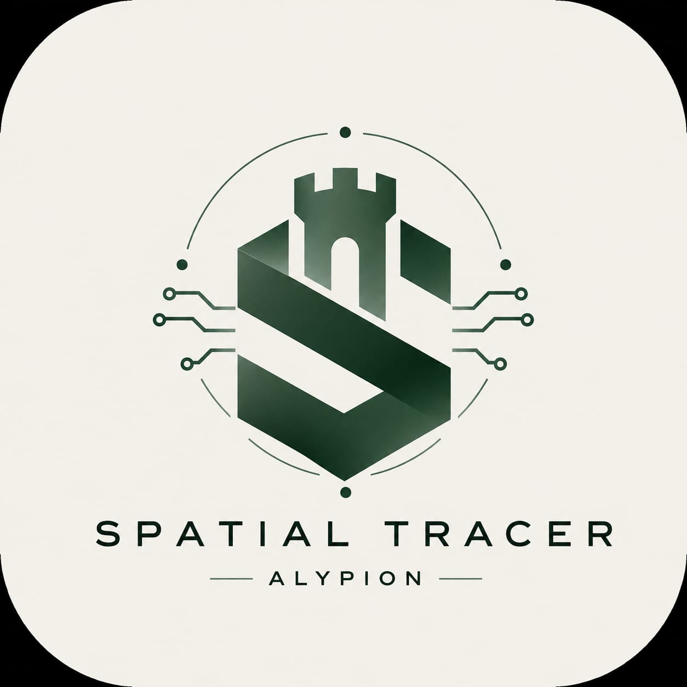

<br/>

# Spatial Tracer v2

**Dual-Engine Air Gesture Control System for Android**

[](https://flutter.dev)
[](https://kotlinlang.org)
[](https://mediapipe.dev)
[](https://www.gnu.org/licenses/gpl-3.0)

<br/>

A production-grade, real-time vision tracking engine that translates mid-air hand and face gestures into native Android OS commands. No wearables. No peripherals. Camera-only spatial input.

[Architecture](#architecture) &nbsp;·&nbsp; [Build Instructions](#build--deploy) &nbsp;·&nbsp; [Contributing](#contributing) &nbsp;·&nbsp; [License](#license)

</div>

<br/>

---

## Application Preview

<div align="center">
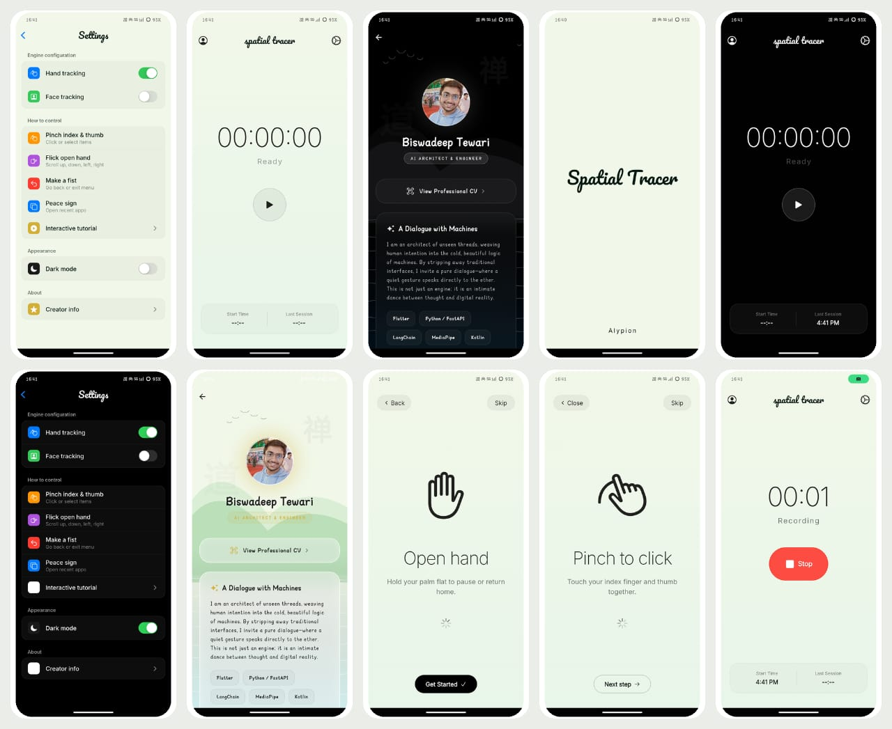
</div>

<br/>

<details>
<summary><strong>Individual Screen Captures</strong></summary>

<br/>

<table>
  <tr>
    <td align="center"><strong>Splash</strong></td>
    <td align="center"><strong>Dashboard (Light)</strong></td>
    <td align="center"><strong>Dashboard (Dark)</strong></td>
  </tr>
  <tr>
    <td>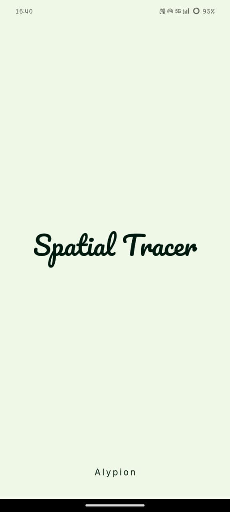</td>
    <td>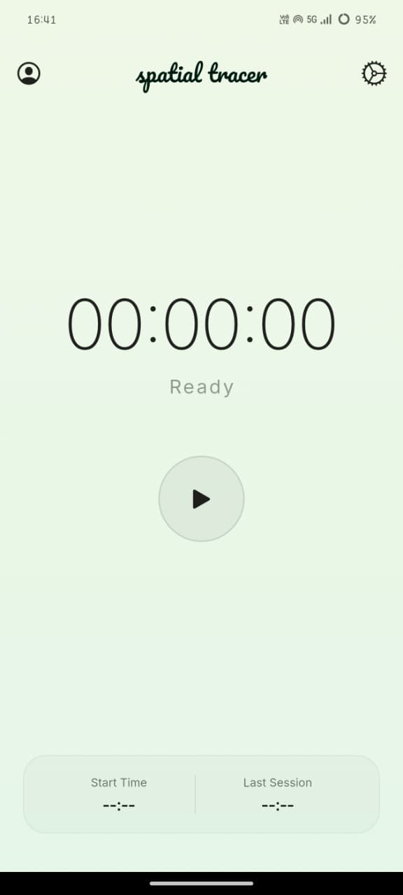</td>
    <td>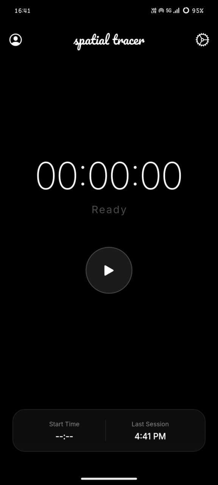</td>
  </tr>
  <tr>
    <td align="center"><strong>Dashboard (Recording)</strong></td>
    <td align="center"><strong>Settings (Light)</strong></td>
    <td align="center"><strong>Settings (Dark)</strong></td>
  </tr>
  <tr>
    <td>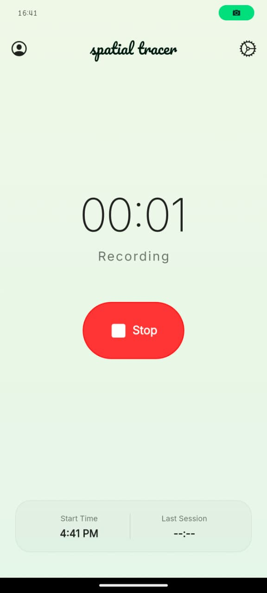</td>
    <td>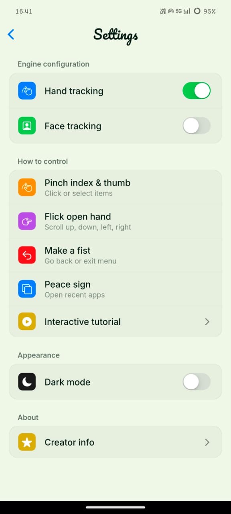</td>
    <td>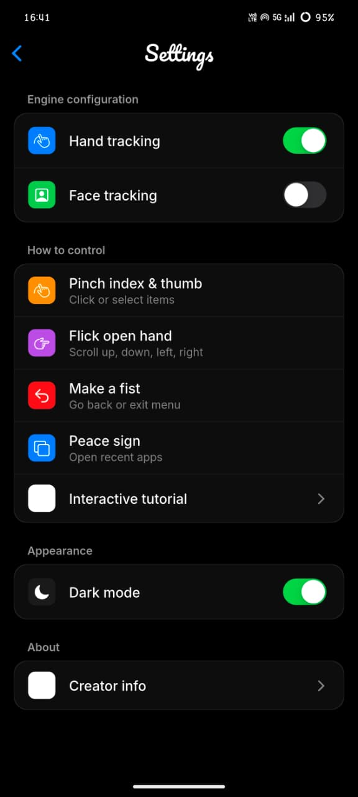</td>
  </tr>
  <tr>
    <td align="center"><strong>Creator Profile (Light)</strong></td>
    <td align="center"><strong>Creator Profile (Dark)</strong></td>
    <td align="center"><strong>Onboarding — Open Hand</strong></td>
  </tr>
  <tr>
    <td>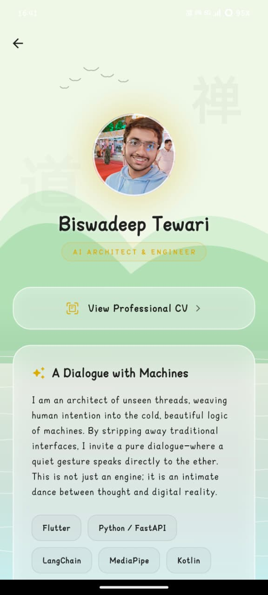</td>
    <td>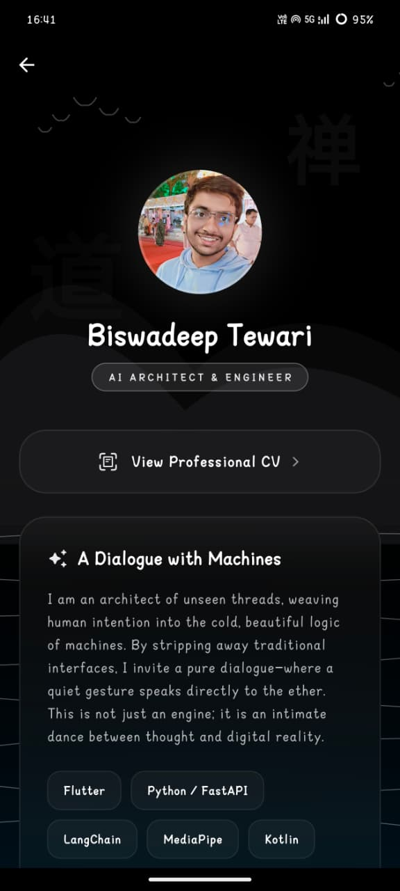</td>
    <td>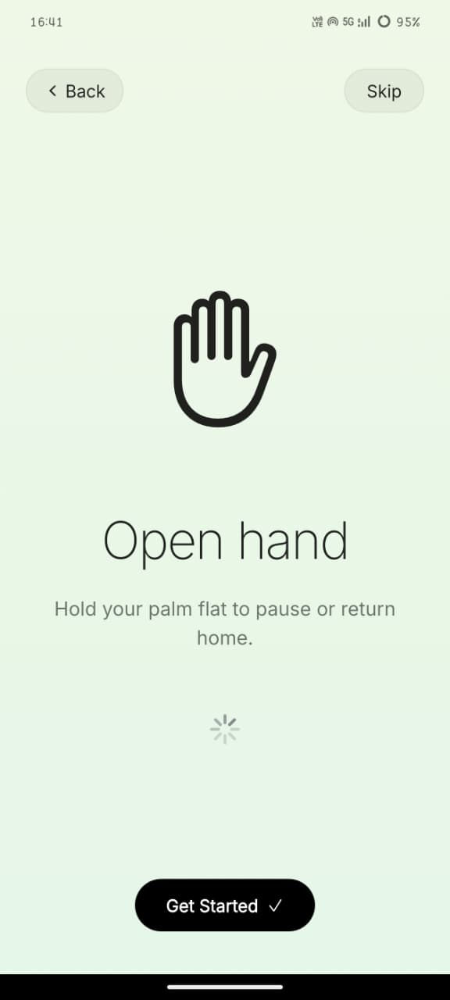</td>
  </tr>
  <tr>
    <td align="center"><strong>Onboarding — Pinch</strong></td>
    <td align="center"><strong>Dashboard (Idle)</strong></td>
    <td align="center"><strong>Logo</strong></td>
  </tr>
  <tr>
    <td>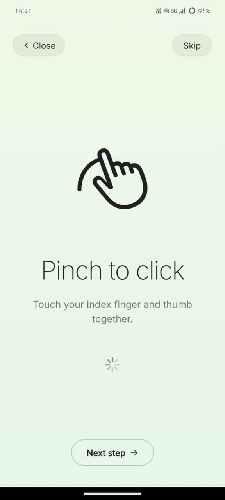</td>
    <td>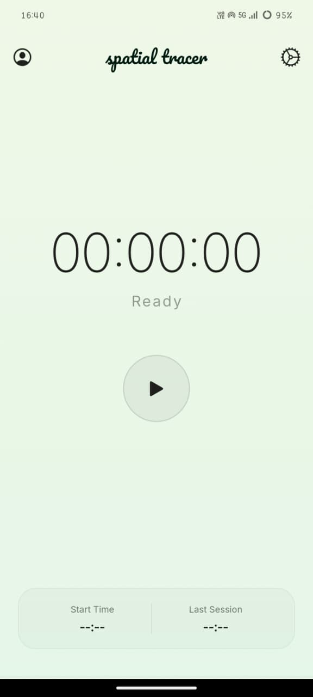</td>
    <td></td>
  </tr>
</table>

</details>

<br/>

---

## Architecture

### System Overview

Spatial Tracer operates as a persistent Android foreground service. The Kotlin-native tracking pipeline captures camera frames via CameraX, processes them through MediaPipe's on-device ML models, and injects the resulting OS-level actions (taps, swipes, navigation) through the Android Accessibility API. The Flutter UI layer communicates with the native engine over platform method channels.

### Tracking Engines

**Hand Tracking** — MediaPipe HandLandmarker extracts 21 three-dimensional landmarks per frame. The `GestureDetector` classifies discrete poses (point, pinch, fist, peace, open hand) and calculates spatial velocity from a rolling 10-frame trajectory buffer for dynamic swipe detection.

**Face Tracking** — MediaPipe FaceLandmarker maps 478 facial landmarks with true Z-depth. Pitch and yaw deflection angles trigger directional scroll injection. Eye Aspect Ratio (EAR) thresholding enables blink-based interaction.

### Signal Processing

All cursor coordinates pass through a **1-Euro (One Euro) Filter** implementation (`OneEuroFilter.kt`). Unlike static EMA smoothing, the filter uses an adaptive cutoff frequency derived from instantaneous velocity — zero jitter at rest, zero lag in motion.

### Directory Structure

```text
mobile-client/
├── android/
│   └── app/src/main/kotlin/com/rajtewari/spatial_tracer_mobile/
│       ├── TrackerService.kt               # CameraX foreground service pipeline
│       ├── GestureDetector.kt              # Hand landmark classification & velocity tracking
│       ├── FaceDetector.kt                 # Face landmark & EAR calculation
│       ├── OneEuroFilter.kt                # Adaptive low-pass signal filter
│       ├── SpatialAccessibilityService.kt  # OS-level touch/action injection
│       ├── CursorOverlay.kt                # TYPE_APPLICATION_OVERLAY cursor renderer
│       └── MainActivity.kt                 # Flutter ↔ Kotlin method channel bridge
├── lib/
│   ├── screens/
│   │   ├── settings_screen.dart            # Engine config & gesture mapping preferences
│   │   ├── splash_screen.dart              # Animated boot sequence
│   │   └── creator_profile.dart            # Parallax creator profile view
│   ├── main.dart                           # Dashboard, session timer & interactive onboarding
│   ├── theme.dart                          # Cupertino-inspired light/dark theme system
│   └── db_helper.dart                      # SQLite session persistence layer
├── assets/
│   ├── images/                             # App iconography, branding & screenshots
│   └── docs/                               # Internal documentation
├── pubspec.yaml                            # Dependency manifest
└── LICENSE                                 # GNU General Public License v3.0
```

<br/>

---

## Gesture Reference

### Hand Tracking

| Gesture | Action | Detection Logic |
| :--- | :--- | :--- |
| **Point** | Move cursor | Index fingertip coordinates mapped to screen space via 1-Euro Filter |
| **Pinch** | Tap / Select | Thumb-to-index tip distance < `0.15` normalized threshold |
| **Fist** | Go Back | All five digits folded — dispatches `GLOBAL_ACTION_BACK` |
| **Peace Sign** | Recent Apps | Index + Middle extended, others folded — `GLOBAL_ACTION_RECENTS` |
| **Open Hand Flick** | Directional Scroll | Five digits extended, spatial velocity > `0.8` units/sec along dominant axis |
| **Three Fingers** | Go Home | Index + Middle + Ring extended — `GLOBAL_ACTION_HOME` |

### Face Tracking

| Gesture | Action | Detection Logic |
| :--- | :--- | :--- |
| **Head Tilt (Vertical)** | Scroll Y-Axis | Pitch angle deflection triggers vertical swipe injection |
| **Head Tilt (Lateral)** | Scroll X-Axis | Yaw angle deflection triggers horizontal swipe injection |
| **Firm Blink** | Recent Apps | Eye Aspect Ratio (EAR) drops below `0.24` threshold |

> When both engines are active, `TrackerService` alternates frame processing between the two ML models to sustain 30 FPS without GPU thermal throttling.

<br/>

---

## Build & Deploy

### Prerequisites

| Dependency | Version |
| :--- | :--- |
| Flutter SDK | `>= 3.11.0` |
| Android SDK | API 24+ |
| Hardware | Physical Android device (emulators lack camera passthrough and overlay injection) |

### Setup

```bash
git clone https://github.com/RajTewari01/spatial_tracer_v2.git
cd spatial_tracer_v2/mobile-client

flutter pub get
flutter run --release
```

### Required Permissions

Spatial Tracer requires three OS-level permissions on first launch:

1. **Camera** — Pipes live frames into MediaPipe models. Video data is processed in-memory only; never stored or transmitted.
2. **Display Over Other Apps** — Renders the `TYPE_APPLICATION_OVERLAY` floating cursor above the OS layer.
3. **Accessibility Service** — Injects taps, swipes, and system navigation events. Must be manually enabled via **Settings > Accessibility**.

<br/>

---

## Contributing

Contributions are welcome and encouraged. This project is maintained under the GNU General Public License v3.0 — all derivative work must remain open-source under the same license.

### Workflow

1. **Fork** this repository.
2. **Create a feature branch** from `main`:
   ```bash
   git checkout -b feature/<short-description>
   ```
3. **Commit** with clear, atomic messages:
   ```bash
   git commit -m "feat(tracker): add velocity damping to swipe detection"
   ```
4. **Push** to your fork and open a **Pull Request** against `main`.
5. All PRs are reviewed by the codeowner before merge.

### Commit Convention

| Prefix | Purpose |
| :--- | :--- |
| `feat` | New feature or capability |
| `fix` | Bug fix |
| `refactor` | Code restructure with no behavior change |
| `docs` | Documentation only |
| `perf` | Performance improvement |
| `test` | Adding or updating tests |

### Code Standards

- **Kotlin** — Follow the [Kotlin Coding Conventions](https://kotlinlang.org/docs/coding-conventions.html). All native signal processing and ML pipeline code resides under `android/app/src/main/kotlin/`.
- **Dart/Flutter** — Follow the [Effective Dart](https://dart.dev/effective-dart) style guide. Use the project's `analysis_options.yaml` for lint enforcement.
- **Architecture** — Maintain the existing separation: Kotlin handles all camera, ML, and OS injection logic; Flutter handles UI rendering and state only. Do not introduce cross-layer coupling.

### Areas of Interest

The following areas are actively open for contribution:

- Additional gesture definitions in `GestureDetector.kt`
- Face tracking gesture expansion in `FaceDetector.kt`
- Cursor appearance customization in `CursorOverlay.kt`
- Onboarding UX improvements in `main.dart`
- Accessibility and localization across all Dart screens
- Performance profiling and battery optimization for the foreground service

### Reporting Issues

Open an issue with:
- Device model and Android version
- Steps to reproduce
- Relevant logs from `adb logcat`

<br/>

---

## Code Ownership

| Path | Owner |
| :--- | :--- |
| `*` (entire repository) | [@BiswadeepTewari](https://github.com/RajTewari01) |

<br/>

---

## License

This project is licensed under the **GNU General Public License v3.0**.

You are free to use, modify, and distribute this software under the terms of the GPL-3.0. All derivative works must be distributed under the same license. See the [LICENSE](LICENSE) file for the full license text.

```
Copyright (C) 2026 Biswadeep Tewari

This program is free software: you can redistribute it and/or modify
it under the terms of the GNU General Public License as published by
the Free Software Foundation, either version 3 of the License, or
(at your option) any later version.
```

<br/>

---

<div align="center">


**Spatial Tracer v2** — Engineered by [Biswadeep Tewari](https://github.com/RajTewari01)

**Alypion**

</div>
